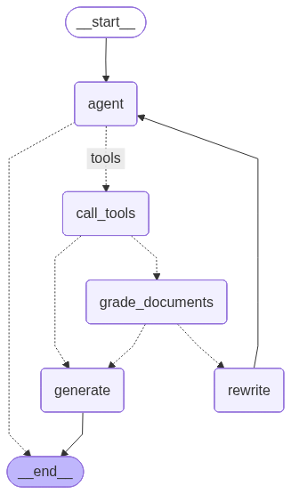
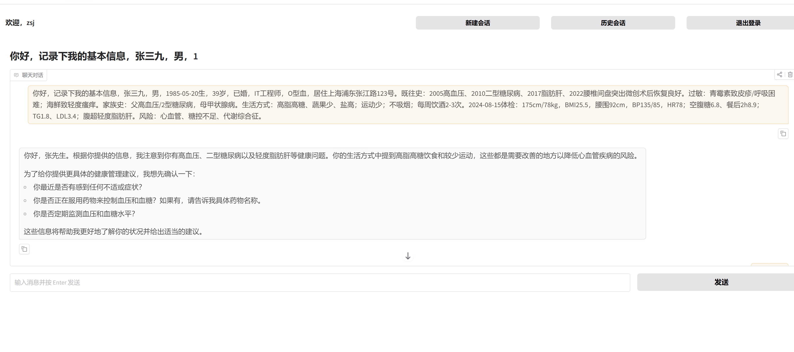

# 项目背景
面向家庭健康管理场景，用户希望系统能够长期维护家庭成员健康档案（过敏史、慢病、用药、家族史、饮食作息等），并结合中西医资料与小儿安全知识，在日常咨询中给出可执行的导诊与风险提示。传统对话系统缺乏“多成员记忆隔离 + 可追溯引用 + 个体化约束”，难以在真实家庭场景落地。

# 数据收集与清理
## 疾病库
下载卫建委指南，并使用mineru解析清理文档，转化为md文件
因为做的是中文agent,所以去除英文
丁香医生常见疾病讲解
爬虫提取 30个科室常见的197个疾病

## 红旗数据库
搜集最常见的50种紧急症状

## 分诊数据库
搜集常见的症状，根据严重等级 年龄等确定是否需要去医院

# 方案选型
因为是中文，选择使用bge-base-zh-v1.5作为embedding model
使用agentic 的rag
，定义三种retrievertool，利用llm判断使用那种信息，若触发红旗病库，则直接提示去医院，若带有问询要去哪个科室，触发triagle retriever，若是科普功能，使用knowledge retriever进行科普
使用长记忆功能，通过特定词触发记录功能，通过user_id搜索历史健康信息，根据人的历史信息做出更准确的判断

# 方案部署
fastapi 后端部署 
gradio前端部署
效果：

